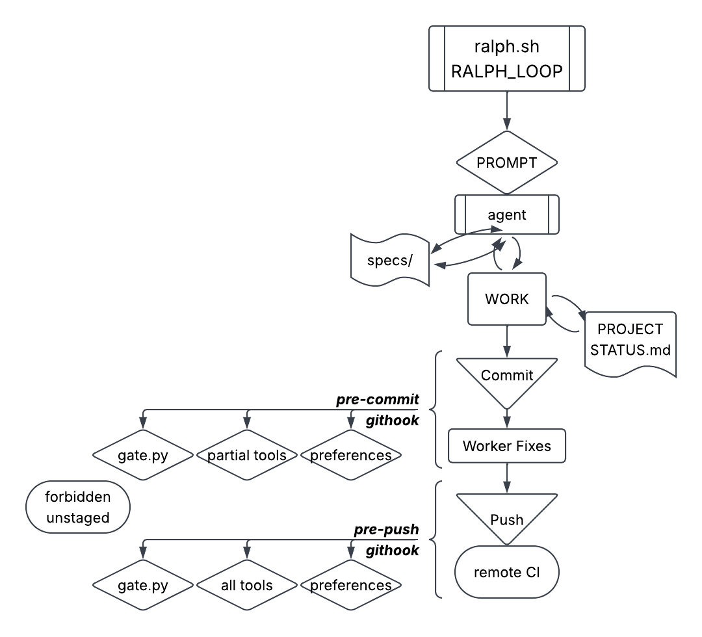

<div align="center">


<h1>L∞PS: A Python Ralph Harness</h1>
<p>Loosely opinionated scaffold for a gated autonomous agent loop ("Ralph"). A dumb Ralph tells an agent to "Go!" and hands it a PROMPT. You set the tasks. No pre-defined, orchestrator. Agents loop on specs. Each iteration a worker commits with guardrails and updates its own specs.</p>


[](https://makeapullrequest.com)


[](https://github.com/sebmestrallet/absurd-badges)
[](https://github.com/sebmestrallet/absurd-badges)


</div>

---

## TL;DR: Getting Started.

1. Use as a project template or drop into your project
2. `uv run harness install <your-project-name>`
3. Write your project goal in [docs/plan.md](docs/plan.md)
4. `harness run <agent=claude|codex|agy|copilot> [max_iterations] [max_minutes]`
5. Not what you wanted? Refine `plan.md` / `PROMPT.md` and re-run

---

## Details

`PROMPT.md` tells each agent to pick a `spec` and build. `specs/` say _what_ to build. The agent decides _what next_. You keep `docs/plan.md` current, and specs get rewritten from it (agent is told in `PROMPT.md` to update the specs). Each iteration the agent updates its spec and `PROJECT_STATUS`. Ideas from [ghuntley](https://github.com/ghuntley), How to Ralph Wiggum.

## Start a new project

Use with new Python projects or drop `harness/` and dependencies into an existing project.

1. From inside the checkout, run `harness install <your-project-name>`. Names the project, installs dependencies, and sets up the git hook.
2. Write your grand vision into `docs/plan.md`.
3. Optionally add the first spec in `specs/`, or have an agent draft the first specs.
4. Put product code under `src/` and list new source directories in `pyproject.toml [tool.coverage.run]`.
5. Strict Ruff rules, type checking, pyright, complexipy, and pytest coverage are set in `pyproject.toml`.
6. Your coding quirks go in `harness/preferences.py`.
7. Run a loop:

```sh
harness run <agent> [max_iterations] [max_minutes]  # agent: claude/codex/agy/copilot. ralph adds prompt
```


## A L∞PS Loop

The repo is the only memory. Each iteration is a fresh-context agent.

- `specs/` say WHAT to build
- constant `PROMPT.md` tells the agent: read `specs/`, review `src/`, build the most important unfinished thing
- agent builds
- agent commits
- every git commit passes the fast preflight (lint, format, plus loop containment for the agent)
- every git push runs the full gate: lint, types, semgrep, tests, 100% coverage
- the loop stops at `max_iterations`, a nonzero worker exit, or a timeout
- Unspecified iterations/minutes → default to 2 iterations × 20 minutes each
- **The harness is worker-agnostic.** Any agent CLI that reads a prompt from stdin and can edit/commit works.


- There is NO worktree/branch creation by design. Agent duties can be contained to a part of the repo. e.g. Codex-1-frontend uses `specs/frontend.md`, Claude-2-researcher `specs/backend`...
- Intentional:
  1. For simplicity and maintainability of the framework.
  2. Because a fresh iteration can't see the unmerged work in another worktree, so agents miss context and scramble to merge while conflicts pile up.
  3. Change this behavior if you're comfortable with granting agents machine access, feeding context to agents, and managing rapidly moving git history.
  4. You can create branches/trees and run a loop in each, then merge.
- If you don't like _ANYTHING_ in this framework, remove it.

## Safety

`harness/ralph.sh` launches an autonomous LLM worker with the permissions you grant it (e.g.
`--permission-mode acceptEdits`). The gate bounds what any **commit** may touch, but the worker itself is **not** sandboxed to this repo. Under a permissive mode it can run arbitrary shell. You are authorizing real changes. Choose the worker and permission mode deliberately. Use `git log --oneline <branch>..HEAD` to show what's unpushed.

#### The Gate: Tiered Checks

`harness/gate.py` holds `FORBIDDEN_FILES`, `FORBIDDEN_DIRS` and `FORBIDDEN_PATTERNS`. `harness/preferences.py` holds human's style checks other tools can't catch. Containment runs when `RALPH_LOOP=1`, which `ralph.sh` sets on each run. `pyproject.toml` holds many rules. Humans own them (`harness/preferences.py` is part of `harness/`).

⚡ `harness preflight` (pre-commit) → fast checks.
Ruff lint + check format for everyone, _plus_ **containment** for the agents. Self-heals by un-staging forbidden files.

✅ `harness gate` (CI/PR pre-push). Local checks mirror CI → ruff lint + format report-only, pyright, pylint, semgrep, complexipy, hypothesis, pytest @ 100% cov.

Only humans can bypass triggered gates and commit by adding flag `--no-verify`.

## Layout

```
harness/        the gate, loop (ralph.sh), CLI, custom user checks   (🤖 forbidden)
  preferences.py  user-defined preferences not covered by tools      (🤖 forbidden)
  gate.py         mirror the CI locally + preferences.py honored     (🤖 forbidden)
  tests/          the harness's own tests                            (🤖 forbidden)
    test_properties.py  hypothesis tests                             (🤖 forbidden)
.githooks/      pre-commit / pre-push gate hooks                     (🤖 forbidden)
.github/        CI that re-runs the gate                             (🤖 forbidden)
pyproject.toml  project + tooling config                             (🤖 forbidden)
AGENTS.md       rules for agents working in the repo                 (🤖 forbidden)
PROMPT.md       the standing per-iteration instruction               (human maintained)
docs/           PLAN, PROJECT_STATUS                                 (human maintained plan.md)
scratchpad/     scratch dir agents can use for temp files            (For the 🤖 to play)
specs/          WHAT to build, one PRIORITY-bannered file per track
src/            your product/source code (add to coverage source)
```

If an agent edits a forbidden file, the file will be unstaged (not allowed to commit). A forbidden pattern by an agent (e.g. `# noqa` will also prevent their commit and force them to fix it.)

## ⚠️ Warnings. Read this before a first run.

1. **This harness does not sandbox agents.** It _tries_ to harness bad code in loops via gates. Sandboxing agents will, e.g. prevent them from maintaining git, running Playwright, being seen as trustworthy by semgrep leading to cyclical failures, etc.

2. **The gate is a guardrail, not a jail.** Agents are crafty, like people. They will find a way to complete a task at all costs. **Trust nothing and no one.**

3. **Mind your usage limits.** `ralph.sh` works agents to the cap set. You can easily burn through your tokens, context windows, and provider usage limits. **Workers continue running as long as there is work to do.**

4. **`PROMPT.md` tells the worker to push every iteration** Protect `main` and run the loop on its own branch.

5. **100% coverage does not mean good tests.** That is quantity, not quality. (Upcoming feature: mutation testing)

## Commands

Tool commands are defined in [harness/gate.py](harness/gate.py#L62-L94).

```sh
harness install <your-project-name>  # rewrite [project] name, uv sync, set core.hooksPath to .githooks
harness preflight  # fast checks: preferences, ruff lint + format (plus loop containment)
harness gate  # full pass: preferences, ruff, format, pyright, pylint, complexipy, semgrep, pytest @ 100% cov, hypothesis
RALPH_LOOP=1 harness gate  # to run as if you are the agent in the loop
harness run <agent> [max_iterations] [max_minutes] [verbose] # claude/codex/agy/copilot, defaults: 2 20 True

# UNDERLYING TOOLS are run the way CI runs them
ruff check . && ruff format --check .  # lint. --check verifies formatting only, no auto-fix
pyright  # static type checker: flags type errors without running code
pylint harness src  # deeper lint: dead code, bad patterns, style beyond ruff
semgrep scan --config auto --config p/secrets --exclude-rule yaml.github-actions.security.github-actions-mutable-action-tag.github-actions-mutable-action-tag .  # SAST. exclude-rule allows the template's floating action tags
pytest --cov --cov-report=term-missing --cov-fail-under=100  # Note: Pydantic is included. Use it.

# UNDERLYING AGENT CALLS (presets defined in AGENTS object at harness/cli.py:30)
harness/ralph.sh 10 20 claude -p --permission-mode acceptEdits --no-session-persistence --output-format stream-json --verbose

harness/ralph.sh 2 20 env -u CODEX_THREAD_ID -u CODEX_CONVERSATION_ID -u CODEX_SESSION_ID codex exec -m gpt-5.5 --json --sandbox danger-full-access -

harness/ralph.sh 3 10 agy --log-file agy.log --print --dangerously-skip-permissions

harness/ralph.sh 2 20 sh -c 'copilot --output-format json --stream on --allow-all-tools -p "$(cat)"'
```

## Expanding your harness

- Edit rules at [pyproject.toml](pyproject.toml) for [ruff](https://docs.astral.sh/ruff/), [pylint](https://pypi.org/project/pylint/), [pydoclint](https://pypi.org/project/pydoclint/0.9.1/), [pyright](https://github.com/microsoft/pyright), [pytest](https://docs.pytest.org/en/stable/), [hypothesis](https://hypothesis.readthedocs.io/), [complexipy](https://github.com/rohaquinlop/complexipy)
- Add forbidden files, directories, or patterns in [gate.py](harness/gate.py)
- Add Hypothesis tests in any test directory, examples at [test_properties.py](harness/tests/test_properties.py)
- [semgrep](https://docs.semgrep.dev/semgrep-ci/sample-ci-configs) has no repo config here. It uses registry configs plus Semgrep's built-in defaults which ignore tests.
- Edit checks in [gate.py](harness/gate.py) and [ci.yml](.github/workflows/ci.yml)
- Removing existing preferences or add your own preferences at [preferences.py](harness/preferences.py). Current preferences:

```py
function_argument_assignment_has_star  # agents use non-specific `def fun(*)`
function_argument_assignment_underscore_lead  # agents love over-using underscore names `def _fun()`
hidden_signature_star_args  # Complain when a function uses *args or **kwargs (it hides function signatures)
dynamic_star_call  # Calls to def fun(*items) breaks when you can't tell how many arguments f is getting
pointless_class  # ensure classes are added for good reasons (carry state, values, methods)
lazy_assert  # enforce real assertions, stronger tests
objects_injected_into_runtime_memory  # finds calls that manipulate global state (dangerous, tricky)
lambda_found  # abolish lambdas for agents to keep their code simpler
lazy_any_type_hints  # abolish type `Any` used to bypass strict type-checking
chaotic_continue_statements  # abolish unecessary nested continue statements, clean code
complex_comprehension  # no needlessly dense list/set/dict comprehensions, prefer linear code
```


