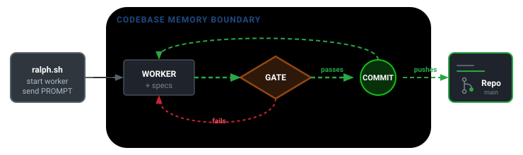
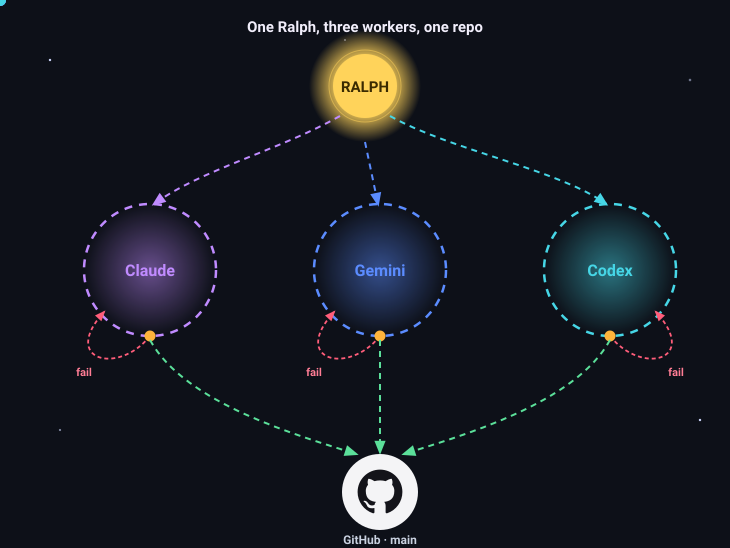

<div align="center">


<h1>L∞pGate</h1>
<h4>Run coding agents strictly and only accept changes that pass your quality gates.</h4>
<p>A loop harness for Claude, Codex, Copilot, or any CLI agent. A loop runner hands each agent a prompt. Agents can edit. Gates decide what lands. You set the plan. Each agent iteration must update specs and commit through quality guardrails.</p>


[](LICENSE)
[](https://makeapullrequest.com)
[](https://www.firsttimersonly.com/)


[](https://github.com/sebmestrallet/absurd-badges)
[](https://github.com/sebmestrallet/absurd-badges)

[](https://github.com/rxdt/loopgate_harness/actions/workflows/ci.yml)

[](https://github.com/rxdt/loopgate_harness/actions/workflows/mutation.yml)


</div>

---

## TL;DR

1. `gh repo create <your-github-username>/<your-new-app-name> --template rxdt/loopgate_harness --private --clone && cd <your-new-app-name> && uv run harness install && source .venv/bin/activate && git add . && git commit --amend --no-edit`
2. `harness run codex`

**Requirements**: `pip`, `uv`, or `poetry`; Python 3.10 or newer; Linux or macOS. Windows support is experimental.

## Index

- [Features](#features)
- [Default Tools](#default-tools)
- [Details](#details)
- [Start a project](#start-a-project)
- [A L∞Pgate Loop](#a-lpgate-loop)
- [Commands](#commands)
- [Directory Layout](#directory-layout)
- [Expanding your harness](#expanding-your-harness)
- [FAQ](#faq)
- [Coordination](#coordination)
- [Before infinity loops](#read-this-before-a-first-run)

---

## Features

Each run starts fresh, has clear limits, saves its logs, protects key files, and must pass checks you choose.
- **Quality-first**: Fight the AI slop with standards and style 💯
- **Gate-enforced work**: Agent changes land only if they pass the quality gates you set ✅
- **L∞P now. What boilerplate?** Start loopiing with quality checks from day one 🔄
- **Built-in stack**: lint, format checks, type-checks, dependency audit, property tests, mutation tests, 100% coverage, complexity analysis, and Semgrep ☑☑☑, git hooks, are the BASICS
- **Hooks ready to go**: pre-commit, pre-push, and commit-message hooks are already hooked up ➜]
- **Worker-agnostic**: Claude, Codex, Copilot, Agy, or any prompt-reading CLI
- **Repo-as-memory workflow**: specs/status/prompt are durable but code is king, leaving you free 😎
- **No-rot**: Fresh-context agent iterations to reduce context rot 🧠
- **Simple**: One-command setup gets you going 🆗
- **Installable project template**: `harness install` gets a repo ready! 🚀
- **Existing-repo setup**: `harness init` adds LoopGate without requiring the template
- **Progressive**: Preflight vs full gate split ᯓ➤
- **Forbidden-file containment**: Don't touch that!-configurable. Set forbidden files for agents ✋
- **No-waste**: Timeouts and time-limits for all looping agents ⏰
- **Diff size guardrails**: Agent's staged Lines Of Code at error 500 and prompt slop refactor 🤌
- **No empty work**: Agents blocked from empty commits ⬜
- **Agent containment prioritized**: Stop the madness
- **Industrial Security** Enabled with [Semgrep](https://semgrep.dev/) 🔓
- **Interactive-agent containment too!**: Run `harness configure-agents` so all Claude/Codex sessions are beholden to the repo checks 🔥

---

## Default Tools
- [ruff](https://docs.astral.sh/ruff/) lints and formats Python code, fast
- [pylint](https://pypi.org/project/pylint/) catches code errors and style problems
- [pydoclint](https://pypi.org/project/pydoclint/0.9.1/) checks docstrings match function signatures
- [pyright](https://github.com/microsoft/pyright) enforces types before code ever runs
- [pytest](https://docs.pytest.org/en/stable/) runs the project's test suite (runs across multiple CPUs)
- [hypothesis](https://hypothesis.readthedocs.io/) generates test inputs to expose edge cases.
**_Tests the code_.** [Real Example](tests/preferences/test_properties.py)
- [mutmut](https://mutmut.readthedocs.io/) mutates your code to find weak tests.
**_Tests the tests_.** Easy to use script at [check_mutmut.py](https://github.com/rxdt/loopgate_harness/blob/main/mutation/check_mutmut.py).
- [complexipy](https://github.com/rohaquinlop/complexipy) flags functions that are too complex
- [semgrep](https://docs.semgrep.dev/semgrep-ci/sample-ci-configs) scans code for security flaws
- [pip-audit](https://github.com/pypa/pip-audit) scans Python environments for package vulnerabilities. Switch out with `["uv", "audit"]` for faster, less-mature [uv audit](https://astral.sh/blog/uv-audit) here: _[audit](pyproject.toml#146)_
- [preferences.py](preferences/preferences.py) A custom AST-parser to optionally expand. It catches e.g. a [style preference](https://google.github.io/styleguide/pyguide) that tools don't.
- Forbidden paths set in [[tool.harness]](pyproject.toml)
- Update `[tool.harness.gate]` or `[tool.harness.gate]` in [pyproject](pyproject.toml) to change what is checked before a commit or push.

#### The Gate: Tiered Checks

⚡ `harness preflight` _(pre-commit)_ are the fast checks to run often. Lint + check format for everyone, _plus_ **containment** for the agents.
> [!NOTE]
> **Self-heals by un-staging forbidden files.**

✅ `harness gate` _(pre-push)_ = _(pre-commit)_ checks **+** type-checks, security audit, dependency audit, complexity analysis, full test coverage, prompt to run mutmut

Only humans can bypass triggered gates and commit, always. Only humans can use flag `--no-verify`.

> [!IMPORTANT]
> ### Network Access

Note that `semgrep --config auto` needs network for semgrep registry rules.
`pip-audit` and `uv audit` also need a network connection to scan the repo.

---

## Details

[docs/plan.md](docs/plan.md) is where you define what you want the end product to be. You must be _very_ clear on what the finished product should and should **not** contain. Do **not** let agents guess.

`docs/PROMPT.md` tells each agent to pick a `spec` and build. `docs/specs/` say _what_ to build. The agent decides _what next_. You keep `docs/plan.md` current, and specs get rewritten from it (agent is told in `docs/PROMPT.md` to update the specs). Each iteration the agent updates its spec and `PROJECT_STATUS`.

> [!IMPORTANT]
> Default configuration is in [`pyproject.toml`](pyproject.toml). Update tool settings, add agent commands, change checks, or leave it as is.

## Start a project

1. `gh repo create <your-github-username>/<your-new-app-name> --template rxdt/loopgate_harness --private --clone` **or**
   ['Use This Template'](https://github.com/new?template_name=loopgate_harness&template_owner=rxdt)
2. Source your environment (if applicable)
3. From the root, install dependencies and run `harness install` to remove template-only files and set up the git hooks. For example: `uv sync && source .venv/bin/activate && harness install`.
4. `git commit` (the `install` command updates the repo)
5. Write your grand vision in [docs/plan.md](docs/plan.md)
6. Optionally add the first spec in `docs/specs/` (or leave it to the agents to draft the first specs based on your `plan.md`)
7. Product code goes in [`src/`](src/).  _List your source code directories in [`pyproject.toml [tool.coverage.run] line 234`](pyproject.toml#toolcoveragerun)_
8. Run some loops!

   `harness run <agent=claude|codex|agy|copilot> [iterations] [minutes]`
9.  Not what you wanted? Refine [`docs/plan.md`](docs/plan.md) / [`docs/PROMPT.md`](docs/PROMPT.md) and re-run
10. Configurations for Ruff linting, type-checking Pyright, Complexipy, Pytest coverage, etcetera are set in [`pyproject.toml`](pyproject.toml).
11. Your coding quirks go in [`preferences/preferences.py`](preferences/preferences.py). Delete functions that don't serve you. Add your own.

### Works with `uv`, `poetry`, or `pip`

```sh
uv sync
source .venv/bin/activate
harness install
git add . && git commit
harness gate
harness run <agent>

poetry install
poetry run harness install
git add . && git commit
poetry run harness gate
poetry run harness run <agent>

python -m venv .venv
source .venv/bin/activate
python -m pip install -r requirements.txt -e .
harness install
git add . && git commit
harness gate
harness run <agent>
```
> [!TIP]
> If you don't like _ANYTHING_ in this framework, [update it](#expanding-your-harness). Or even better, [contribute](CONTRIBUTING.md).
>


## A L∞Pgate Loop / Graph / Universe

The repo is the only memory. Each iteration is a fresh-context agent, driven by our loop runner, [Ralph](#faq).

- `docs/specs/` say WHAT to build
- constant `docs/PROMPT.md` tells the agent: read `docs/specs/`, review `src/`, build the most important unfinished thing
- agent builds
- agent commits
- every git commit passes the fast preflight (lint, format, plus loop containment for the agent)
- every git push runs the full gate: lint, types, semgrep, tests, 100% coverage
- the loop stops at `max_iterations`, a nonzero worker exit, or a timeout
- Unspecified iterations/minutes → default to 2 iterations × 20 minutes each
- Each run streams agent 'thought' output live and is saved in a local scratchpad log
- **The harness is worker-agnostic.** Any agent CLI that reads a prompt from stdin and can edit/commit works.



## Commands

Tool commands are defined in `[tool.harness]` in [pyproject.toml](pyproject.toml).

```sh
harness install  # install dependencies, remove template-only files, and set up git hooks
harness init  # add LoopGate to an existing repository (configurations copied from your config files)
harness configure-agents  # configures Claude and Codex with containment rules and environment variables
harness preflight  # fast checks: preferences, ruff lint + format (plus loop containment)
harness gate  # full pass: preferences, ruff, format, pyright, pylint, complexipy, semgrep, pip-audit, pytest @ 100% cov, hypothesis
harness info  # show configured agents, checks, and protected paths
harness status  # shows run log link, the newest json / latest run of N loops, 1 iteration
RALPH_LOOP=1 harness gate  # explicitly run as if you are the agent in the loop
harness run <agent> [max_iterations] [max_minutes] [verbose] # claude/codex/agy/copilot, defaults: 2 20 True

# AGENT CALLS
harness run claude 10 20
harness run codex 2 20
harness run agy 3 10
harness run copilot 2 20
```
#### To run LoopGate with Claude (or Codex) the worker must be installed and authenticated separately.

```sh
harness run claude 2 20
```

### Run logs

Every run is saved as a log file in `scratchpad/runs/`. `harness status` shows how many logs you have and the path to the newest one. Open that file to read what the agent thought and did. _(Metrics and audited logs coming soon.)_

### Add a mutation score badge

Run `uv run mutmut run && uv run mutmut export-cicd-stats`, then use [check_mutmut.py](mutation/check_mutmut.py) to write `mutation-score.json` for the Shields badge.

### Containment

`harness run` launches an autonomous LLM worker with the configured permissions, e.g.
`--permission-mode acceptEdits` or `--sandbox danger-full-access`.

`harness configure-agents` will set rules for Codex and Claude. It sets `RALPH_LOOP=1` in `~/.claude/settings.json` and `~/.codex/config.toml` (and saves backup files), plus rules that stop agents from changing those settings. **So interactive IDE AND terminal sessions face the same gates as loop workers.** You can read the exact rules at [config.py:23](harness/config.py#L23) (Codex) and [config.py:174](harness/config.py#L174) (Claude).

The gate bounds what any **commit** may touch, but the worker itself is **not** sandboxed to this repo unless you set that config. Consider the balance: without access it cannot do much. With machine access it can wreak havoc. Under a permissive mode it can run arbitrary shell. You are authorizing real changes. Choose the worker and permission mode deliberately.


<details>
  <summary>

## Directory Layout

</summary>

```
harness/        the gate, loop runner, CLI                           (🤖 forbidden directory)
  tests/          the harness's own tests
  gate.py         run the full local gate + honor preferences.py
  cli.py          command-line entry point
  js-scaffold   javascript example to build upon
preferences/    user-defined preferences not covered by tools        (🤖 forbidden directory)
tests/
  preferences/  (🤖 tests/preferences is forbidden directory)
.githooks/      pre-commit / pre-push gate hooks                     (🤖 forbidden directory)
pyproject.toml  project + tooling config                             (🤖 forbidden)
docs/           PROMPT, specs/, your plan                            (agent and human maintained)
scratchpad/     scratch dir agents can use for temp files            (For the 🤖 to play)
src/            your product/source code (add to coverage source)
```

[`pyproject.toml`](pyproject.toml) is the single source of harness configuration. Humans own it and [`preferences/`](preferences/); both are agent-protected.

If an agent edits a forbidden file, the file will be unstaged (not allowed to commit). A forbidden pattern by an agent (e.g. `# noqa` or `nosemgrep` will also prevent their commit and force them to fix it.)

</details>

<details>
  <summary>

## Expanding your harness </summary>

- Edit rules at [pyproject.toml](pyproject.toml) for [ruff](https://docs.astral.sh/ruff/), [pylint](https://pypi.org/project/pylint/), [pydoclint](https://pypi.org/project/pydoclint/0.9.1/), [pyright](https://github.com/microsoft/pyright), [pytest](https://docs.pytest.org/en/stable/), [hypothesis](https://hypothesis.readthedocs.io/), [complexipy](https://github.com/rohaquinlop/complexipy), [mutmut](https://mutmut.readthedocs.io/)
- Add forbidden files, directories, or patterns in `[tool.harness]` at [pyproject.toml](pyproject.toml)
- Add [Hypothesis](https://hypothesis.readthedocs.io/) tests in any test directory, examples at [test_properties.py](tests/preferences/test_properties.py).
- Run [mutmut](https://mutmut.readthedocs.io/) by hand with `uv run mutmut run`, then `uv run mutmut browse`. A surviving mutant is source code in need of a better test. Easy to use script at [check_mutmut.py](https://github.com/rxdt/loopgate_harness/blob/main/mutation/check_mutmut.py).
- [semgrep](https://docs.semgrep.dev/semgrep-ci/sample-ci-configs) has no repo config here. It uses registry configs / Semgrep's built-in defaults which ignore tests. Feel free to add a configuration file for it or any tool.
- Update `[tool.harness.gate.checks]` in [pyproject.toml](pyproject.toml) to change the full gate.
- Run the same gate in CI by adding a step to your workflow (e.g. `.github/workflows/ci.yml`):

```yaml
- run: uv sync && uv run harness gate
```
- Add or remove coding preferences [preferences.py](preferences/preferences.py) that only agents in loops **must** respect. Current preferences:

```py
function_argument_assignment_has_star  # agents use non-specific `def fun(*)`
named_with_underscore_and_not_in_class_or_dunder  # agents love over-using underscore names `def _fun()`
hidden_signature_star_args  # Complain when a function uses *args or **kwargs (it hides function signatures)
dynamic_star_call  # Calls to def fun(*items) breaks when you can't tell how many arguments f is getting
pointless_class  # ensure classes are added for good reasons (carry state, values, methods)
lazy_assert  # enforce real assertions, stronger tests
objects_injected_into_runtime_memory  # finds calls that manipulate global state (dangerous, tricky)
lambda_found  # abolish lambdas, make agents keep their code simple
lazy_any_type_hints  # abolish type `Any` used to bypass strict type-checking
chaotic_continue_statements  # abolish unecessary nested continue statements, clean code
complex_comprehension  # no needlessly dense list/set/dict comprehensions, prefer linear code
```

</details>

<details>
  <summary>

### FAQ </summary>

- **Who is Ralph?**

Ralph is our name for LoopGate's loop runner — the small program that starts your coding agent, hands it the prompt, and starts a fresh agent when the last one finishes. The name comes from the "Ralph Wiggum" technique: run an agent in a simple loop, over and over, until the work is done. Anything starting with `RALPH_` (like `RALPH_LOOP=1`) is just a setting Ralph gives the agent that says "you are inside the loop, follow the loop rules."

- **`harness run <agent>` exits immediately / can't find the worker?**

LoopGate does not install or log in agent CLIs. Install and authenticate the worker you selected (`claude`, `codex`, `copilot`, or `agy`), confirm it is on your `PATH` (e.g. `which codex`), then retry. If `which` finds the binary but the run still fails, finish that tool's login/auth flow and retry `harness run`.

- **What is the difference between a gate and a sandbox?**

A **gate** is a workflow checkpoint that evaluates code and decides whether it is allowed to land in your commits. A **sandbox** is an isolated OS-level environment designed to prevent code from modifying your underlying machine. LoopGate uses gates to control your git history, but it does _not_ provide a secure OS sandbox.

- **What if I don't want to build an app in Python?**

You don’t have to. The loop runner, Ralph, and the CLI take a prompt, launch agents pointed at markdown files. LoopGate is language-agnostic at the agent-loop level, but the template is configured to be Python-specific at [pyproject.toml](pyproject.toml). Add your language and commands for your checks to run there.

- **Javascript?**

The included [`harness/js-scaffold`](harness/js-scaffold/package.json) is a simple JavaScript **example** to expand on. Go to [pyproject.toml line 75](pyproject.toml#L75). Update checks. Put `js` into list `[tool.harness].languages`. Remove `py` if unused.

```
npm run --prefix harness/js-scaffold gate
npm run --prefix harness/js-scaffold preflight
```

- **Why not just a shell loop?**

A shell loop only reruns an agent. LoopGate ensures fresh context, durable repo state, time and iteration limits, protected paths, and quality gates that stop bad changes _before_ they land.

#### LoopGate Glossary

Short definitions of common LoopGate terms.

- harness: the LoopGate tool that runs agents, manages loops, and checks changes.
- loop: one cycle of work where the worker reads instructions, works on a spec, makes changes, runs checks, and records progress.
- worker: the coding agent that does the work, such as Claude, Codex, or Copilot.
- gate: the checks that decide whether changes can be accepted. LoopGate runs these checks locally and in CI.
- preflight: the quick checks that run before the full gate to catch common problems early.
- prompt: the instructions in `docs/PROMPT.md` that tell the worker what to do in each loop.
- spec: a file in `docs/specs/` that describes what needs to be built.
- Ralph: LoopGate's loop runner. It starts the worker, gives it the prompt, and runs the workflow for each iteration.

</details>

<details>
  <summary>

## Coordination </summary>

- Use `git log --oneline <branch>..HEAD` to show what's unpushed.
- There is NO worktree/branch creation by design. You can create branches/trees and run a loop in each, then merge _(if you feel like managing that)_
- Agent duties can be contained to a part of the repo. e.g. Codex-1-frontend uses `docs/specs/frontend.md`, Claude-2-researcher `docs/specs/backend`...

### If you want to run a graph

**Recommendations for running several agents at once on one branch (no worktrees):**

- **You (human):** seed each spec once with this exact line near the top:

  ```
  Spec claimed by agent: <unclaimed>
  ```

- **The agents:** paste this exact block into [PROMPT.md line 3](docs/PROMPT.md#L3):

  ```
  Other agents are working this repo. Before touching code, pick a spec whose claim line is
  <unclaimed>, replace it with your exact name `<your-agent-id>-<spec-you-worked>-<RALPH_ITERATION>/<MAX_ITERATIONS>`, e.g. `claude-0003-backend-3/3`, and commit that claim first. Own that spec's file and its tests. Set the line back to <unclaimed> on your last commit.
  ```

  `RALPH_ITERATION` and `MAX_ITERATIONS` are numbers the loop hands each agent: which round it is on, and the total rounds allowed.

- What fails when agents do not claim specs/work: agents all pick the top-priority spec, duplicate work, and leave a half-staged git index.
- What fails with too little time i.e. MAX_MINUTES too low: a worker dies mid-`gate` before it can commit. Give each iteration enough minutes to finish (the gate itself takes a while). One successful iteration needs ~2-3 min of pure overhead aside from 'real' work.
  - A worker killed too soon leaves its spec claim STUCK: spec stays locked to its name. No other agent will take it until a human resets the line to `<unclaimed>`.
  - preflight on git commit: ~ a few seconds
  - full gate on git push: ~20-48s
  - push + cleanup: ~ few seconds -
- Do not rely on agent names for coordination: agents self-name inconsistently and can collide (e.g. two both call themselves the same thing). Names are for human blame/log-matching only; the claim line + committed code are what actually coordinate.

- Which doc does what:
  - **specs** = the product work
  - **`docs/PROMPT.md`** = how to operate headlessly
  - **repo + green gate** = the source of truth
  - `docs/PROJECT_STATUS.md` is a human-readable record, not authoritative

- No branch/worktree creation in this harness was intentional:
  1. For simplicity and maintainability of the framework.
  2. Because a fresh iteration can't see the unmerged work in another worktree, so agents miss context and scramble to merge while conflicts pile up.
  3. Change this behavior as you like.

</details>

<details>
  <summary>

## Read before Infinity Loops </summary>

1. **This harness does not sandbox agents.** It tries to harness bad code in loops via gates. Sandboxing agents will, e.g. prevent them from maintaining git, running Playwright, being seen as trustworthy by semgrep leading to cyclical failures, etc.

2. **The gate is a guardrail, not a jail.** Agents are crafty, like people. They will find a way to complete a task at all costs. **Trust nothing and no one.**

3. **Mind your usage limits.** `harness run` works agents to the cap set. You can easily burn through your tokens, context windows, and provider usage limits. **Workers continue running as long as there is work to do.**

4. **`docs/PROMPT.md` tells the worker to push or not**.

5. Protect `main` and run the loop on its own branch.

6. **100% coverage does not mean good tests.** That is quantity, not quality. Run `uv run mutmut run` to find covered lines that no assertion actually checks.

</details>


## License

[MIT LICENSE](LICENSE)

Want to help? [CONTRIBUTING.md](CONTRIBUTING.md).
